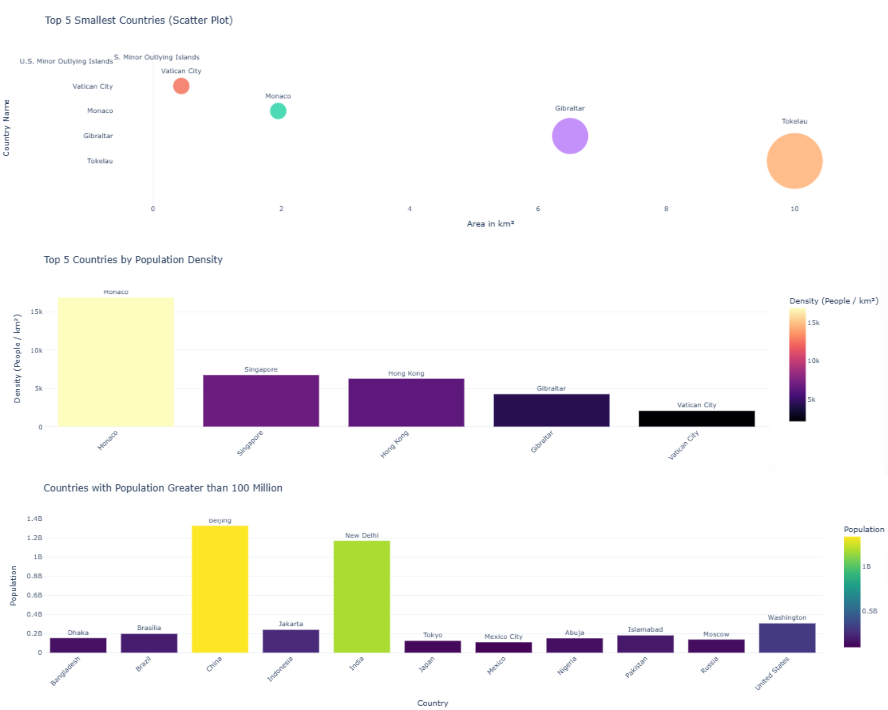

# Countries of the World Data Pipeline & Analysis

An automated data pipeline and exploratory data analysis project that extracts global demographic metrics via web scraping, processes the data using Python, and builds interactive visualizations[cite: 2].

## Project Architecture & Layout
* **`RawData/countries_of_the_world.csv`**: Structured dataset containing 250 rows across 4 key features: Country, Capital, Population, and Area[cite: 2].
* **`notebooks/Countries_of_the_World.ipynb`**: Comprehensive Jupyter notebook containing the complete web extraction script, data cleaning workflow, statistical summaries, and interactive charts[cite: 2].

## Data Extraction Pipeline
* **Source Targeting**: Connects to the ScrapeThisSite Simple Sandbox target to retrieve raw demographic web elements[cite: 2].
* **Parsing Logic**: Utilizes Python's `requests` and `BeautifulSoup` libraries to iterate through country container blocks (`div.country`), parsing text nodes for names, capitals, population, and area metrics[cite: 2].
* **Data Export**: Serializes the parsed data into a clean Pandas DataFrame before persisting the output to `../RawData/countries_of_the_world.csv`[cite: 2].

## Data Analysis & Visualizations
* **Data Cleansing**: Inspects and resolves missing administrative data, standardizing missing text strings for regions lacking formal capitals[cite: 2].
* **Feature Engineering**: Computes derived metrics including population density ($\text{population} / \text{area}$) and regional aggregations[cite: 2].
* **Interactive Dashboarding**: Employs `plotly.express` to generate interactive bar charts showcasing top populated countries and spatial distribution scatter plots[cite: 2].

---

### Smallest Nations, Population Densities & Major Populations
*Analysis of the top smallest countries by area via scatter plots, population density rankings across high-density regions, and demographic breakdowns for nations with populations exceeding 100 million.*

